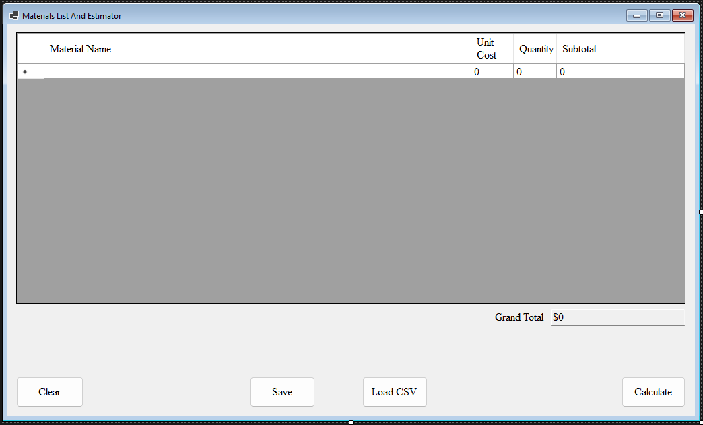

## Materials List and Estimator



Materials List and Estimator is a simple Windows Forms application that allows you to create a list of materials, their unit costs, quantities, and automatically calculates subtotals. You can also calculate the grand total and save the list to and open it from a csv file.

## Features

- Add materials to the list with unit costs and quantities.
- Validate input to ensure unit costs and quantities are numerical.
- Calculate subtotals for each material automatically.
- Calculate the grand total of all subtotals.
- Save the list to a .CSV file for future reference.
- Open a list from a .CSV file for editing.

## Installation

1. Clone or download this repository to your local machine.

```bash
git clone https://github.com/tempest918/MaterialsListAndEstimator.git
```

2. Open the solution in Visual Studio or your preferred C# development environment.

3. Build and run the application.

## Usage

1. Launch the application.

2. Enter the material name, unit cost, and quantity in the DataGridView.

3. The application will automatically calculate the subtotal for each material as you enter data.

4. To calculate the grand total, click the "Calculate" button.

5. To save the list to a text file, click the "Save" button and choose a location to save the file.

6. To clear the list and reset the grand total, click the "Clear" button.

7. To open a list from storage, click the "Load CSV" button.
